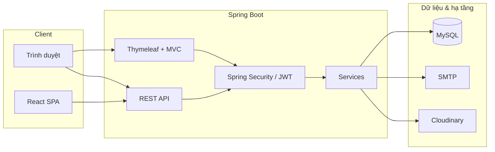

<div align="center">

# Quản lý học viên (LMS)

**Nền tảng học trực tuyến full-stack** — quản lý khóa học, người dùng đa vai trò, giỏ hàng, ghi danh và phân quyền rõ ràng giữa học viên, giảng viên và admin.

<br/>


</div>

---

## Tại sao dự án này nổi bật?

| Điểm mạnh | Mô tả ngắn |
|-----------|------------|
| **Bảo mật thực tế** | Spring Security, JWT, reCAPTCHA khi đăng ký, phân quyền theo vai trò (học viên / giảng viên / admin). |
| **Nghiệp vụ LMS đầy đủ** | Khóa học theo module/bài học, tiến độ, chứng chỉ; thống kê và export dữ liệu phục vụ vận hành. |
| **Tích hợp dịch vụ** | Gửi email xác thực, upload ảnh qua Cloudinary, export dữ liệu Excel (Apache POI). |
| **Kiến trúc rõ ràng** | REST API song song giao diện server-side (Thymeleaf) và module React; tách lớp Controller — Service — Repository. |

---

## Tính năng chính

- **Khóa học**: danh mục, module, bài học, tiến độ học tập, chứng chỉ.
- **Người dùng**: đăng ký / đăng nhập, xác thực email, JWT cho API.
- **Thương mại**: giỏ hàng, đăng ký khóa học (enrollment).
- **Admin & giảng viên**: dashboard, quản lý học viên / tài khoản / khóa học (theo phân quyền).

---

## Công nghệ sử dụng

**Backend**

- Spring Boot 3 · Java 17  
- Spring Data JPA · Hibernate · MySQL 8  
- Spring Security · JWT (jjwt)  
- Thymeleaf + Layout Dialect  
- Spring Mail · Google reCAPTCHA  
- Cloudinary · Apache POI / OpenCSV · Lombok · Jsoup  

**Frontend**

- React 19 (thư mục `frontend/`, Create React App)  
- Giao diện chính: Thymeleaf templates  

---

## Kiến trúc tổng quan



---

## Cấu trúc thư mục (rút gọn)

```
quanlyhocvien/
├── src/main/java/com/dacs/quanlyhocvien/
│   ├── Controllers/      # MVC + REST (auth, course, admin, …)
│   ├── Services/         # Nghiệp vụ nền tảng LMS
│   ├── config/           # Security, JWT, Cloudinary, …
│   ├── models/           # Entity JPA & DTO
│   └── Utils/            # Tiện ích, export Excel, …
├── src/main/resources/
│   ├── templates/        # Thymeleaf
│   ├── static/
│   └── Database/         # Script SQL mẫu
├── frontend/             # React (npm start / build)
├── pom.xml
└── README.md
```

---

## Yêu cầu môi trường

- **JDK 17**  
- **Maven 3.8+**  
- **MySQL 8** (database mặc định trong config: `quanlyhocvien`)  
- **Node.js 18+** (nếu chạy frontend React)  

---

## Cài đặt & chạy nhanh

### 1. Database

Tạo database và import schema (tham khảo):

- `src/main/resources/Database/CreateTable.sql`  
- `src/main/resources/Database/InsertData.sql`  
- hoặc `db.sql` ở thư mục gốc (nếu phù hợp phiên bản của bạn)  

### 2. Cấu hình ứng dụng

Chỉnh `src/main/resources/application.properties` (hoặc dùng profile riêng, ví dụ `application-local.properties` **không commit**):

- URL, user, password MySQL  
- `app.jwt.secret`, `app.jwt.expiration`  
- SMTP (Gmail hoặc provider khác)  
- `google.recaptcha` (site key + secret)  
- `cloudinary.*`  
- `app.base-url` (URL public cho link xác thực email)  

> **Lưu ý bảo mật:** Không đẩy API key, mật khẩu mail hay JWT secret lên Git công khai. Nên dùng biến môi trường hoặc file local được `.gitignore`.

### 3. Chạy backend

```bash
mvn spring-boot:run
```

Ứng dụng mặc định: **http://localhost:8080** (tùy cổng bạn cấu hình).

### 4. Chạy frontend React (tùy chọn)

```bash
cd frontend
npm install
npm start
```

---

## API tiêu biểu

| Nhóm | Ví dụ endpoint |
|------|----------------|
| Xác thực | `POST /api/register`, `POST /api/login` |
| Khóa học | REST dưới `/api/...` (course, module, lesson, category) |
| Người dùng / giỏ hàng / ghi danh | `UserAPIController`, `CartApiController`, `EnrollmentApiController` |

Chi tiết đầy đủ nằm trong các class `@RestController` trong package `Controllers`.

---

## Roadmap gợi ý (portfolio)

- [ ] `application.yml` + Spring Cloud Config / biến môi trường chuẩn hóa  
- [ ] Docker Compose (MySQL + app)  
- [ ] Test tích hợp (Testcontainers) cho luồng đăng ký và API khóa học  
- [ ] CI (GitHub Actions): `mvn verify` + `npm test`  

---

## Giấy phép & đóng góp

Dự án phục vụ mục đích học tập / demo portfolio. Nếu bạn fork hoặc tái sử dụng, vui lòng ghi nguồn tác giả.

---

<div align="center">

**Được xây dựng với Spring Boot, React và tư duy phân quyền rõ ràng cho LMS.**

</div>
